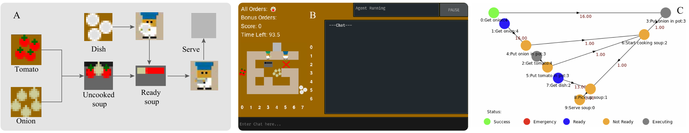
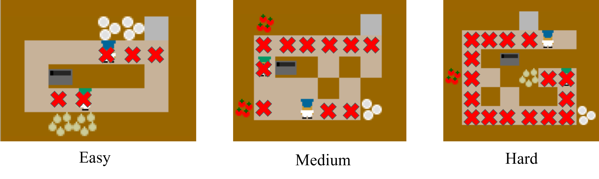
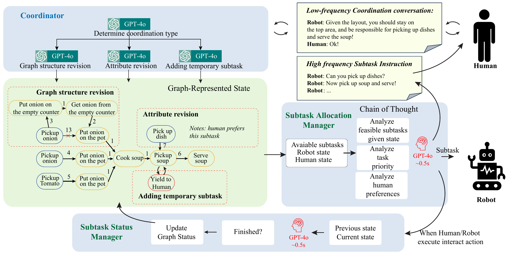

# HRT-PR-OVERCOOKED 

<p align="center">
   
  <i>HRT-PR interface based on Overcooked AI environment</i>
</p>

## Project Links

- **📄 Paper**: [arXiv Link](YOUR_ARXIV_LINK_HERE)
- **🌐 Project Website**: [https://shipengliu.com/hrt-pr-overcooked/](https://shipengliu.com/hrt-pr-overcooked/)
- **📹 Demo Videos**: Available on our project website

## Environment

We built our system on top of the original [Overcooked AI](https://github.com/HumanCompatibleAI/overcooked_ai) environment, which provides an ideal testbed for studying human-robot collaboration as it requires coordination, task division, and real-time communication—key elements of effective teaming.

<p align="center">
  
  <br><i>Different game layouts used in our experiments</i>
</p>

## Agent Modes

Our framework supports three different agent interaction styles:

<p align="center">
  
  <br><i>Overview of different agent modes and their characteristics</i>
</p>

- **Default**: A greedy agent collaborates with humans without any communication.
- **Passive leader-follower style**: Agent receives and acts upon instructions based on human preferences.
- **Active peer-to-peer style**: Besides receiving and acting upon instructions, it also provides feedback based on human past behavior.


## Installation
Create a Conda environment with Python 3.10 

``` 
conda create -n overcooked_ai python=3.10
conda activate overcooked_ai
```

**Note:** We use the original Overcooked AI as our test environment. You need to specify numpy version 1.26.4 in their setup.py file.

Clone the repo recursively
```
git clone --recursive git@github.com:QianLabUSC/lassie-human-ai-interaction.git
```
clone the overcooked ai environment 
```
cd lassie-human-ai-interaction
git clone --recurse-submodules https://github.com/HumanCompatibleAI/overcooked_ai.git
git submodule init
git submodule update
```

To use overcooked ai environment
```
cd overcooked_ai
pip install -e .
```
Install required dependency
```
cd lassie-human-ai-interaction
pip install -r requirements.txt
```

To use Open AI API, create your own API key and create an .env file located in the overcooked_llm folder contains:
```
OPENAI_API_KEY="YOUR_OPENAI_API_KEY"
```


## Testing out ChatOverCooked Interface

### LLM Model Selection

Our framework supports multiple LLM models for both the Coordinator and Subtask Manager components. You can specify different models using the following command-line arguments:

**Available Models:**
- `gpt` - OpenAI GPT-4 (default)
- `gpt_mini` - OpenAI GPT-4o Mini
- `llama` - Llama 3.1 via Ollama
- `gemma` - Gemma 2B via Ollama  
- `llava` - Llava 7B via Ollama
- `sglang` - Local Llama 3 8B with SGLang
- `rule` - Rule-based system

**Usage Examples:**
```bash
# Use GPT for both coordinator and subtask manager
python main.py --coordinator_model gpt --subtask_manager_model gpt

# Use Llama for coordinator and GPT for subtask manager
python main.py --coordinator_model llama --subtask_manager_model gpt

# Use different models for different components
python main.py --coordinator_model gpt_mini --subtask_manager_model llama
```

**Basic Usage:**
```bash
cd src/
python main.py
```

You can always change the arguments in the commands to experiment with different model combinations.

the user study log and video will be saved under overcooked_llm/src/user_study

## Game Introduction 
The game is between a LLM-driven agent with a human player. Similiar to Original overcooked ai, we added a chat interface where human will be able to chat with another agent and change agent behavior based on their preferences. An example instruction would be: "you should only make onion soup, I will serve dishes". 
### Agent styles: 
There are three type of agents: active Supervisor, Passive mentee, and default receptive agent. 

- Default: a greedy agent collaborates with humans without any communication.
- Passive leader-follower style: agent receives and acts upon instructions based on human preferences.
- Active peer-to-peer style: beside receive and acts upon instructions. it also provide feedback based on human past behavior.
  
### Interface: 
You will be control blue hat agent. use up/down/left/right key to move and space bar to interact with environment. 
in case of communicate with another agent, click on pause button, then type in your instruction in the text input box. afterwards, agent will be updated once the game is resumed. chat session is shown on the right. Vertical coordinates indicating row(x) numbers and  horizontal coordinates indicating column(y) numbers. 


## Code Structure Overview

`src` contains:

`data/`:

- `config/`: contains Overcooked game initial configuration files
- `layout/`: contains different layout files

`llm/`:

- `task/`: LLM prompts. des_1_layout.txt contains the prompt that is actually being fed to LLM.
- `llm_agent.py`: customized greedy human model. injected with LLM modified code.
- `llm_api.py`: LLM API calls with text/code extraction. with code reflection implementation.
- `utils.py`: LLM prompt tips.
  
`mdp/`:

- `llm_overcooked_mdp.py`: LLM agent related code inheritance. added human action history logging for active agent. 

`user_study/`:

- `log/`: contains folders of logs/video for each participants.
  
`planning/`:

- `planners.py`: customized MediumLevelActionManager for LLM. enable more actions to use.

`main.py`: script for start a chatovercook pygame session.

